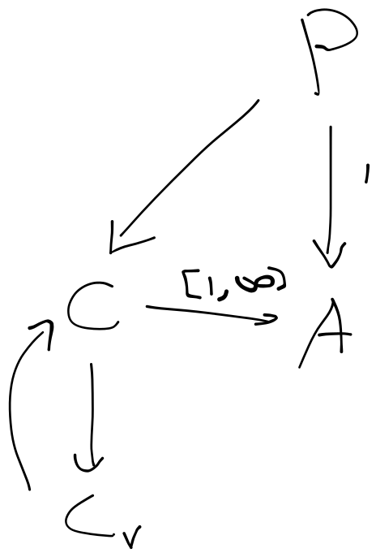

# Amplifier

---
A engine to enhance/compliment LLMs to enable complex reasoning/logic, explainability, and steerability.
The purpose of this project is to explore the potential for incremental problem-solving in LLMs through more rigidly
defined reasoning loops.

### Complex Reasoning
Complex Reasoning is a process that is recursive/infinite, it's essentially a search of all accessible information necessary
to solve a problem. To solve a problem with 100% confidence requires access to all information, every piece of information has at least
some relevance to every problem with the right context, even if only to ensure reality is always coherent (assuming that it is). 
For example the information the planets orbit the sun is necessary to validating the claim that gravity exists, because although
gravity works here on earth, it may be that only earth has gravity. Or more abstractly, the information that I
went to the bathroom and nothing unusual happened yesterday is necessary to prove with 100% accuracy that the universe obeys logical rules. As unless you check
there is no absolute guarantee that I ate dinner with a T-Rex.

Therefor, to solve a problem, you have to have a confidence level and a confidence heuristic, something that says how accurate
this needs to be, and something that estimates how likely our answer is to be correct. This project's goal is to implement
this 'problem space' search for LLMs. Although most information is continuous and doesn't come in discrete concepts like language
we assume that enough problems that humans would need to solve can be solved through this medium.

This projects implements such a search + accumulate process for LLMs to prove if it works. 
In future a LMM built for this task would probably be necessary to improve it further.

### The Loop

---

The way this works is to solve a problem, you can either answer the question directly, or recall information relevant
to the problem, this information can be organized into distinct groups called 'coherence groups', these groups represent
nuggets of information that are all internally consistent or provide context to one another.

Coherence Group

 
For example, to solve a political problem, different ideologies may be (surface level) internally consistent and result in
different answers. Each ideology would form its own coherence group, and would produce their own answer to the question.

For each coherence group you output an answer, or you 'verify' individual pieces of information within each coherence group
to check if it's correct using other pieces of information. To 'verify' a piece of information is itself a question eg. ('is X correct?')
and the validation process is the same as the root problem-solving, and like the root problem-solving there can
be multiple answers as to the validity of the information. Once a piece of knowledge is verified, the original coherence
grouping that triggered the verification process is re-cohered (the coherence process is re-started) with the replacement
knowledge.

Keep in mind that different coherence groups aren't necessarily contradictory, but they will appear either unrelated to each
other or surface-level contradictory. It is possible that on closer inspection, the two sets of information are actually related,
but until that inspection process is done, it's hard to tell.

Verification Example

 
Continuing from the previous example, not all ideologies are created equal, and some are 'more correct' than others.
To figure out which ones are right and which ones are wrong, you have to:

    - verify the components that created a particular idea in that ideology (the ""children"" nodes)
        - For example in philosophy, it's important to understand what is just a cultural norm and what is 'fact'
    - see if the idea agrees with other observations (the ""sibling"" nodes)
        - We use this in science, if a theory makes predictions about reality and they agree with them, then we know
            it might be correct, or at the very least that it's useful.
    - see if the idea can create a new coherent idea (the ""parent"" nodes)
        - In data science, sometimes the individual assumptions made in a model aren't tested and are based off of intuition
        - However if the overall model is valid then it's possible the assumptions used to make the model are too.

Notice that each of these descriptions describe a 'radiating' process, effectively a breadth-first-search. The first
process has to verify the components of the information being verified, the second has to verify the observations that are 
related to the process being verified, and the third has to verify the new idea made from the information (and check if the new idea
being right has any indication on the validity of the original idea).

Another consequence of the infinite nature of problem-solving is that until you've seen everything, 
you will always have a continuum of answers (or in this discrete case, a probability of having more than one answer).

## Abstract Advantages

Interestingly, this same process can be used to digest long segments of text, images, or any kind of data that can be
graphically organized. 

Universal Information Digestion

 
As long as the network can navigate from node to node, it should (in theory) be able to use it
as regular information. For example, the paragraphs of a wikipedia page could be 'connected' via keywords, the paragraph number,
and pages could be connected by inter-page references. Images could be connected via 'blurry' interpretations of the image
that are connected to 4 nodes, each are lazily-evaluated interpretations of each quadrant of the image, then the knowledge
coherence process could combine these 4 quadrants into a new understanding of the whole image. Similar to peripheral vision in humans or
a discrete case convolutional neural network.

Additionally, you might notice that 'breaking down' a problem isn't mentioned, this is because the described process automatically
performs this operation.

Problem Decomposition

 
This is because the process of 'selecting' an answer can itself
be a coherence process. To break down a problem, first attempt to solve the problem with the initially recalled information, this creates
groupings that target different aspects of the problem (each aspect of the problem would appear unrelated to each other forming coherence groups) 
these would each produce differing (probably incorrect) answers. Then, the set of answers is cohered, if an answer successfully tackled its aspect
of the problem, then it is either left untouched as its own coherence group, or combined with other answers for aspects of the problem.

The parts of the problem that were too hard to tackle in one go will undergo verification, to verify a solution for part of a problem you
form coherence groups, and thus answers to parts of the part of the problem. This is the same as problem decomposition.

